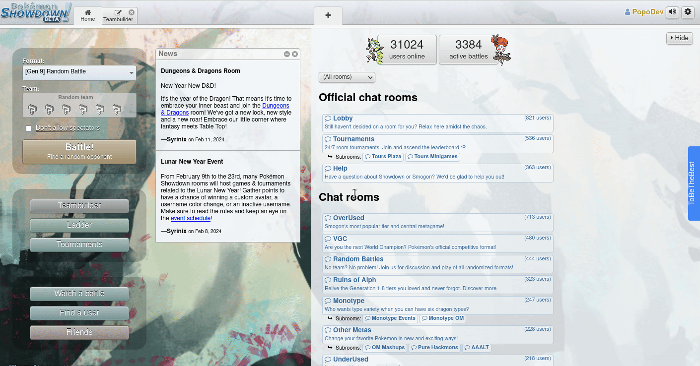

# ToBeTheBest Extension for Pokemon Showdown

A browser extension for [Pokemon Showdown](https://play.pokemonshowdown.com/) including features such as a teambuilder, usage rate stats and more! The extension aims to assist users in creating powerful teams, understanding move sets, and making informed decisions during battles. To learn more about ToBeTheBest, visit our [Website](https://tobethebest.vercel.app/).

## Table of Contents
- [Quick Start](#quick-start)
- [Features](#features)
- [Usage](#usage)
- [Repository Layout](#repository-layout)
- [For Developers](#for-developers)
  - [Getting Started](#getting-started)
  - [Building the Extension](#building-the-extension)
  - [Testing](#testing)
  - [Coding Guidelines](#coding-guidelines)
- [Issues, Feature Requests and Contributions](#issues-feature-requests-and-contributions)
- [License](#license)

## Quick Start
- **Step 1**: Install `ToBeTheBest` Extension
  - **Firefox**: [Latest Release on Github](https://github.com/To-be-the-best-CSE403/CSE403-To_be_the_best-front/releases/)
    - Download `tobethebest-firefox.zip` and unzip the file.
    - Go to `about:debugging#/runtime/this-firefox`.
    - Click `Load Temporary Add-on...` and select the unzipped folder.
  - **Chrome**: [Latest Release on Github](https://github.com/To-be-the-best-CSE403/CSE403-To_be_the_best-front/releases/).
    - Download `tobethebest-chrome.zip` and unzip the file.
    - Go to `chrome://extensions/` and enable "Developer mode" in the top right corner.
    - Click `Load unpacked` and select the unzipped folder.

- **Step 2**: Go to [Pokemon Showdown](https://play.pokemonshowdown.com/) and activate the extension. 
  - **Firefox**: Go to extension setting and choose `Always Allow on play.pokemonshowdown.com`.
  - **Chrome**: Go to extension setting and allow the extension for `play.pokemonshowdown.com`.

## Features
Learn more about the features of the Pokemon Showdown ToBeTheBest extension.

- **Team Builder**: Build your team with ease using the extension's team builder.
- **Common Movesets**: View common movesets for each Pokemon.
- **Damage Calculator**: Calculate the damage of a move based on the Pokemon's stats and the opponent's stats.

## Usage
Hover on the `ToBeTheBest` toggle button on the right side of the screen to show the extension's sidebar. The sidebar will appear with a transition and you can access the following features:

- **Team Builder**: Choose a Team `Archetype` from the dropdown menu and click "Create Team" to generate a team tailored to your chosen strategy.
- **Resources**: Access additional resources to enhance your Pokémon Showdown experience:
  - **Website**: Visit the ToBeTheBest website for more information and updates
  - **Wiki**: Explore the wiki for detailed guides and strategies.
  - **Github**: Contribute to the project or explore the source code on GitHub.



## Repository Layout
<details>
<summary>design</summary>

    # Design documents for the project
    ├── README.md              
    └── uml                             # UML diagrams
        └── UI_Components.drawio.png

</details>
<details>
<summary>public</summary>

- Contains public assets used in the application.

</details>


<details>
<summary>src</summary>

    # Source code for the extension
    ├── api.ts                        # API Endpoints
    ├── pages                         # Pages for the extension
    │   ├── background                # Background scripts       
    │   ├── content                   # Content scripts
    │   │   ├── injected                    
    │   │   └── sidebar               
    │   └── popup                     # Popup page for the extension       
    └── shared                        # Shared components

</details>

<details>
<summary>test</summary>

- Setup the test environment for the extension.

</details>

<details>
<summary>utils</summary>

    # Extension boilerplate for Chrome and Firefox using Vite
    # See: https://github.com/Jonghakseo/chrome-extension-boilerplate-react-vite

    ├── manifest-parser                      # Parse manifest.json
    ├── plugins                              # Plugins for Vite    
    │   ├── add-hmr.ts                       # Hot module reloading
    │   ├── custom-dynamic-import.ts         # Custom dynamic import
    │   ├── inline-vite-preload-script.ts
    │   ├── make-manifest.ts
    │   └── watch-rebuild.ts
    └── reload                               # Reloading mechanism
        ├── injections                       # Injected scripts 
        ├── interpreter                      # Interpreter for injected scripts  
        ├── initReloadClient.ts
        ├── initReloadServer.ts
        ├── constant.ts
        └── utils.ts

</details>


## For Developers

You can clone this repo with the following commands:

```bash
git clone https://github.com/To-be-the-best-CSE403/CSE403-To_be_the_best-front
```

### Getting Started
First install the dependencies:

```bash
npm install
```

Then run the extension in development mode:

```bash
npm run dev
```
Open localhost in your browser to see the extension.

### Building the extension

#### Chrome
To build the extension the extension for Chrome, use the following command:

```bash
npm run build
```

To see the extension in action, open Chrome and go to `chrome://extensions/`. Make sure that the `Developer mode` checkbox in the top right corner is checked. Then click `Load unpacked` and select the `dist` folder in the project directory.

#### Firefox
To build the extension for Firefox, use the following command:

```bash
npm run build:firefox
```

To see the extension in action, open Firefox and go to `about:debugging#/runtime/this-firefox`. Click `Load Temporary Add-on...` and select the `manifest.json` file in the `dist` folder in the project directory.

### Testing
To run the tests, use the following command:

```bash
npm run test
```

Example of a test snippet:

```tsx
// Import necessary modules
import { render, screen } from '@testing-library/react';
import ComponentToTest from './ComponentToTest';

// Describe the component or functionality being tested
describe('ComponentToTest', () => {
  // Describe the specific test case
  test('should render without errors', () => {
    // Arrange: Render the component
    render(<ComponentToTest />);
    
    // Act: Perform actions (if any)
    
    // Assert: Make assertions about what is expected
    // Test that the component renders without throwing an error
    const component = screen.getByTestId('component-to-test');
    expect(component).toBeInTheDocument();
    
    // Additional assertions can be added here
  });
  
  // Add more test cases as needed
});
```

## Coding Guidelines

### Linter
Use [ESLint](https://eslint.org/) to lint your code. You can run ESLint with the following command:

```bash
npm run lint
```

### Formatting
Use [Prettier](https://marketplace.visualstudio.com/items?itemName=esbenp.prettier-vscode) extension for VSCode to format your code.

### TypeScript
Follow the [Google TypeScript Style Guide](https://google.github.io/styleguide/tsguide.html). The most important rules that the project will follow are:

#### Naming
| Style            | Category                                                     |
|------------------|--------------------------------------------------------------|
| UpperCamelCase   | Class / Interface / Type / Enum / Decorator / Type Parameters / Component Functions in TSX / JSXElement Type Parameter |
| lowerCamelCase   | Variable / Parameter / Function / Method / Property / Module Alias |
| CONSTANT_CASE    | Global Constant Values, Including Enum Values                 |

#### Documentation
There are two types of comments, JSDoc (`/** ... */`) and non-JSDoc ordinary comments (`// ...` or `/* ... */`).

- Use `/** JSDoc */` comments for documentation, i.e., comments a user of the code should read.
- Use `//` line comments for implementation comments, i.e., comments that only concern the implementation of the code itself.

#### Typing
- Do use TypeScript's types as much as possible.
- Do use `undefined` when necessary; **do not** use `null`.

## Issues, feature requests and contributions 
- If you come across a problem with the extension, please open an [issue](https://github.com/To-be-the-best-CSE403/CSE403-To_be_the_best-front/issues/new/choose) and choose the bug report template.
- If you have a feature request, please open an [issue](https://github.com/To-be-the-best-CSE403/CSE403-To_be_the_best-front/issues/new/choose) with the feature request template.
- Contributions are always welcome! Please see [CONTRIBUTING.md](CONTRIBUTING.md) for more information.

## License
This project is licensed under the MIT License - see the [LICENSE](LICENSE) file for details.
